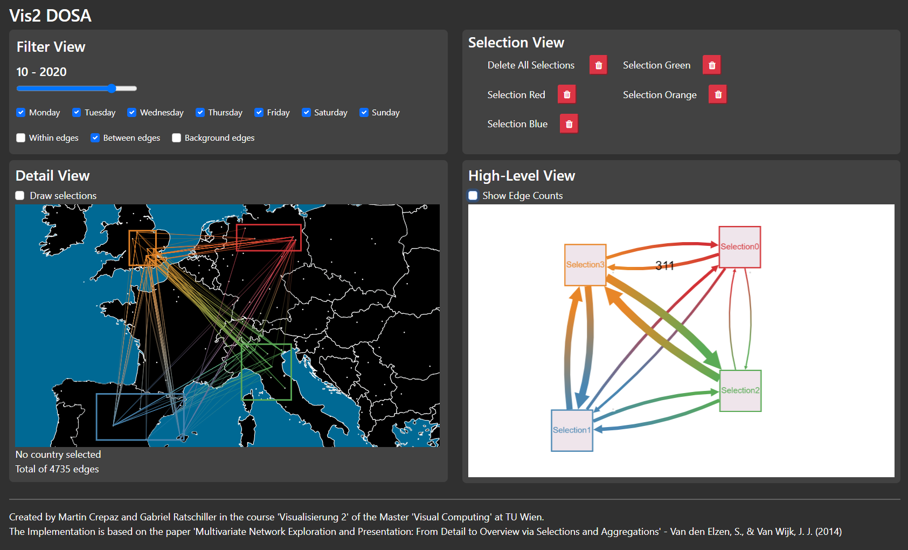

# DOSA : Multivariate Network Exploration and Presentation

by Martin Crepaz & Gabriel Ratschiller

## Multivariate Network Exploration and Presentation: From Detail to Overview via Selections and Aggregations - An Application to visualize flight connections in Europe.

### General
This project is an implementation of the method DOSA (Detail to Overview via Selections and Aggregations) described in the paper "Multivariate Network Exploration and Presentation. From Detail to Overview via Selections and Aggregations" by Stef van den Elzen and Jarke J. van Wijk and was developed as part of the university course "Visualization 2" at the TU Wien.

The paper describes a method to visualize multivariate network data using two juxtaposed coupled views: a detail view and a high-level view.
With the help of selections of interests and aggregation of the selected data points the network data can be clearly visualized and studied.

### Implementation & Usage
The UI consists of three interactive views: one view to select the month and the edges to display. One view for the map and the interaction with the map. One view for the high level information based on the selection in the map.

#### Filter view
In the filter view, the desired data sets can be loaded into the program. The data consists of monthly flight data between European airports (249 airports in total) and ranges from January 2019 to March 2021. By default, the data set for January 2019 is selected. The desired data set can be loaded into the program via the month slider. The current selections and the high-level graph are retained and updated accordingly.
In addition, certain days of the week can be selected if only flights at certain times of the week are to be displayed.

It is possible to select which edges are to be displayed. There are three types of edges:
- within edges: flights between airports within one selection
- between edges: flights between airports in different selections
- background edges: flights between airports, where one airport is in a selection and the second airport is not in any selection.

#### Detail view
In the detail view, selections can be drawn on the map and selections can be deleted again in the selection tab. The map can be moved and zoomed in and out. To create a new selection the 'drawing mode' must be selected. If the drawing mode is selected, it is no longer possible to interact with the map (zooming, panning) but selections can be drawn on the visible part of the map.

It is possible to click anywhere to define the upper left corner of the selection rectangle, move the mouse and click again to define the lower right corner of the selection rectangle. Once a selection has been created, a separate node is created in the high-level view with the same name and color.

As soon as another selection is created, e.g. the between-edges can be selected (if they were not already selected before creation) and the high-level graph is updated accordingly.

#### High-level view
In the high-level view, the selection data is aggregated and displayed in a directed graph. The selections can be moved freely to increase the overview or to personalize the visualization. If the mouse is hovered over an edge or node, the corresponding aggregated data (number of flights for edges, number of airports within the selection for nodes) are displayed. This data can also be permanently shown or hidden via a checkbox.

### Dataset
The data set was provided by the website "zenodo" under the entry "Crowdsourced air traffic data from The OpenSky Network 2020". (https://zenodo.org/record/4737390)
The data consists of monthly worldwide flight data, for our application we have reduced the data to the European data.

#### Provided dataset (sample)
- 'flightlist_201901': January 2019 - 228964 entries
- 'flightlist_201910': October 2019 - 324985 entries
- 'flightlist_202011': November 2020 - 86448 entries

### References
S. van den Elzen and J. J. van Wijk, "Multivariate Network Exploration and Presentation: From Detail to Overview via Selections and Aggregations." IEEE Transactions on Visualization and Computer Graphics, 2014. (https://ieeexplore.ieee.org/document/6875972)